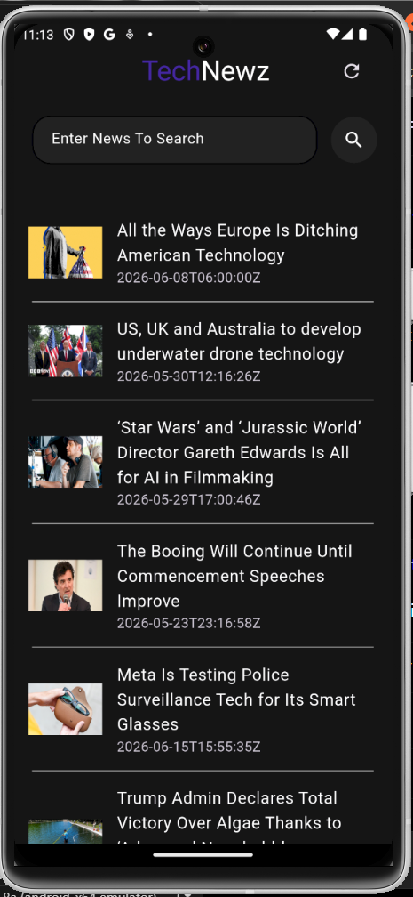
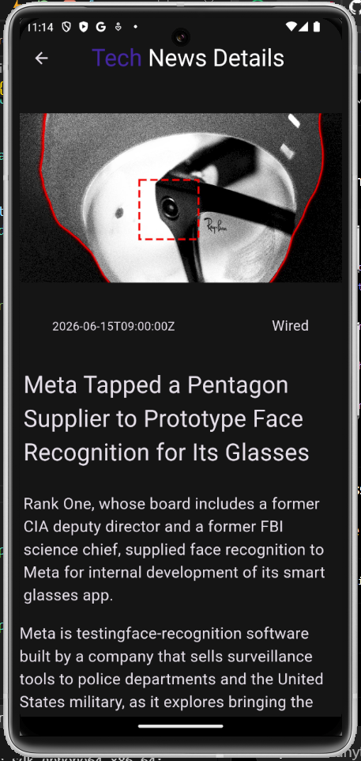
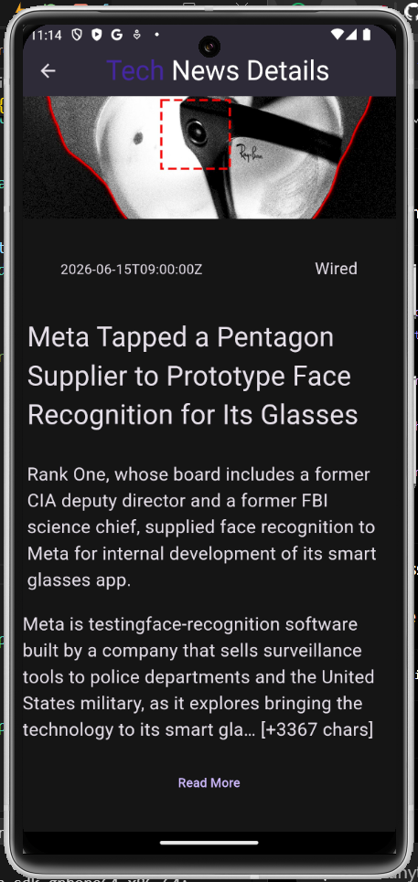
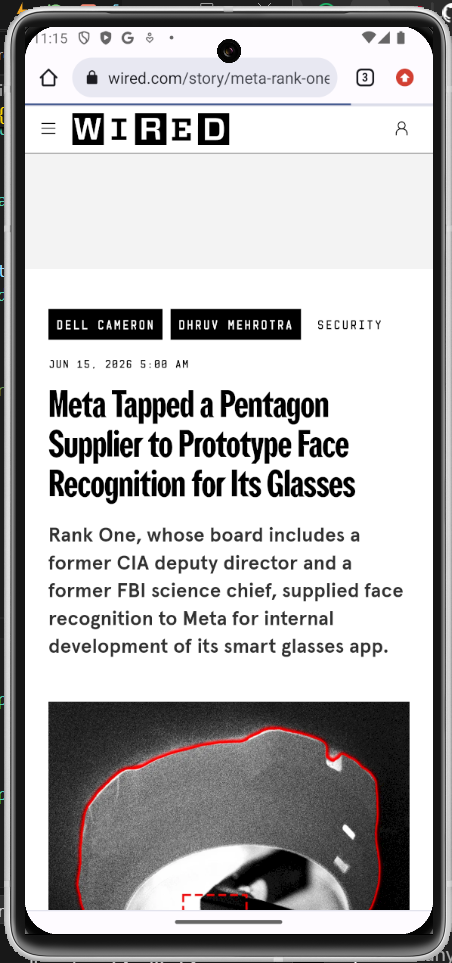
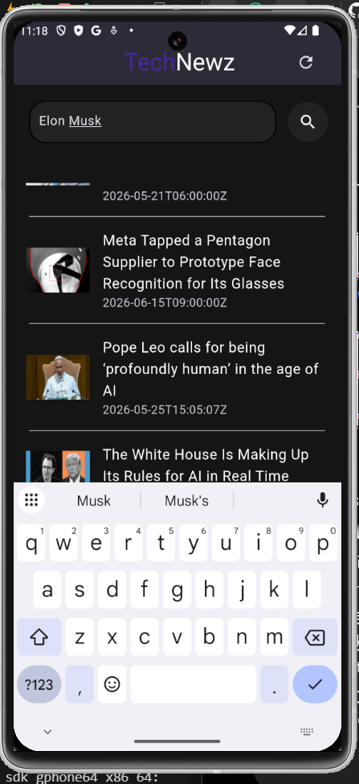
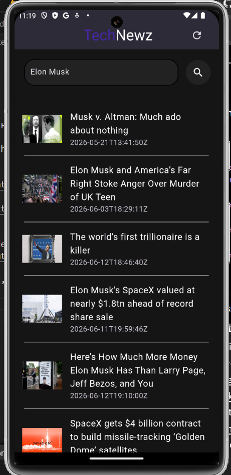

# 🌐 Tech News App

A Flutter-based news application that delivers the latest technology news from around the world using the NewsAPI service. Users can browse trending tech articles, search for specific topics or personalities, view detailed article information, and open the original article directly in their browser.

---

## Overview

Tech News App is a simple yet powerful Flutter application designed to keep users updated with the latest developments in technology. The app fetches real-time news articles from NewsAPI and displays them in an easy-to-navigate interface.

### Key Features

* Live technology news fetched from NewsAPI
* Search functionality for finding specific topics, companies, or people
* Detailed article view with image, description, and content
* Bottom sheet preview for quick article summaries
* Open full articles in the user's default web browser
* Refresh button for loading the latest news
* Fallback images for articles that do not provide thumbnails

---

## Technologies Used

### Flutter Packages

```yaml
dependencies:
  flutter:
    sdk: flutter
  cupertino_icons: ^1.0.8
  google_fonts: ^6.3.2
  http: ^1.6.0
  cached_network_image: ^3.4.1
  url_launcher: ^6.3.2
  flutter_dotenv: ^5.1.0
```

### APIs & Tools

* **NewsAPI** – Used for fetching live technology news articles.
* **Postman** – Used for testing and validating API responses during development.

---

## Application Screens

### Home Page

<p align="center">
  
</p>

The home page is the main screen of the application. It displays a list of the latest technology news articles fetched directly from the API.

---

### Article Preview Bottom Sheet

<p align="center">
  
</p>

When a user taps on any news article, a bottom sheet appears showing:

* Article title
* Short description
* View More button

---

### Article Details Page

<p align="center">
  
  
</p>

Selecting **View More** from the bottom sheet opens a dedicated details page.

The details page displays:

* Article image
* Publication date
* News source
* Full title
* Description
* Article content

---

### Official Article Website

<p align="center">
  
</p>

When the user clicks the **Read More** button on the details page, the application launches the article URL in the device's default browser.

---

### Search Functionality

<p align="center">
  
  
</p>

The search feature allows users to find news related to a specific topic, company, or person.

For example:

* Searching for Elon Musk
* Searching for a technology company
* Searching for a specific technology trend

The application fetches and displays only the articles relevant to the entered search query.


---

## Project Structure

```text
lib/
│
├── backend/
│   └── newsfunc.dart
│
├── components/
│   ├── newscard.dart
│   └── searchbar.dart
│
├── pages/
│   ├── startpg.dart
│   └── detailspg.dart
│
├── utils/
│   ├── api.dart
│   ├── colors.dart
│   └── text.dart
│
└── main.dart
```

---

## How It Works

1. The application starts by fetching technology news from NewsAPI.
2. Articles are displayed on the home page.
3. Users can search for specific topics using the search bar.
4. Tapping an article opens a bottom sheet preview.
5. Selecting **View More** opens the detailed article page.
6. Selecting **Read More** launches the original article URL in the browser.

---

## Future Improvements

* Category-based news filtering
* Bookmark/Favorites system
* Dark/Light theme support
* Pull-to-refresh functionality
* News sharing support
* Pagination for loading more articles
* Better image caching and loading states

---

## Author

Developed as a Flutter learning project to practice:

* API Integration
* HTTP Requests
* JSON Parsing
* State Management
* Navigation
* Custom Widgets
* URL Launching
* Flutter UI Development

```
```
